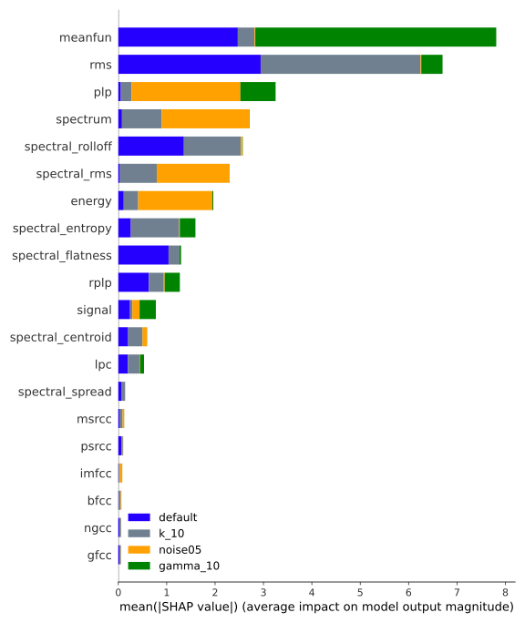

# Barkhausen experiments

### Results

| model | accuracy per class |
| ----- | ------------------ |
| HGBC  | 99.783 %           |

Confusion matrix:


SHAP values:



### Barkhausen dataset features graphs

### [Spectral_standard](https://unict-fake-audio.github.io/audio-datasets-overview/#/datasets?feature=spectral_std&system_id=A01_A06&speaker=LA_0069&feature_per_speaker=0&dataType=0&dataset=BARKHAUSEN&algorithm=false)


### [Spectral_rolloff](https://unict-fake-audio.github.io/audio-datasets-overview/#/datasets?feature=spectral_rolloff&system_id=A01_A06&speaker=LA_0069&feature_per_speaker=0&dataType=0&dataset=BARKHAUSEN&algorithm=false)


### [Perceptual Linear Prediction (plp)](https://unict-fake-audio.github.io/audio-datasets-overview/#/datasets?feature=plp&system_id=A01_A06&speaker=LA_0069&feature_per_speaker=0&dataType=0&dataset=BARKHAUSEN&algorithm=false)


## How to run the same experiment

### Install

Use a python virtual env (strongly recommended) and install all the requirements:

```bash
pip install -r requirements.txt
```

### Usage

```bash
python3 run_experiment.py
```

The script will load the saved model `hgbc_barkhausen.sav`
